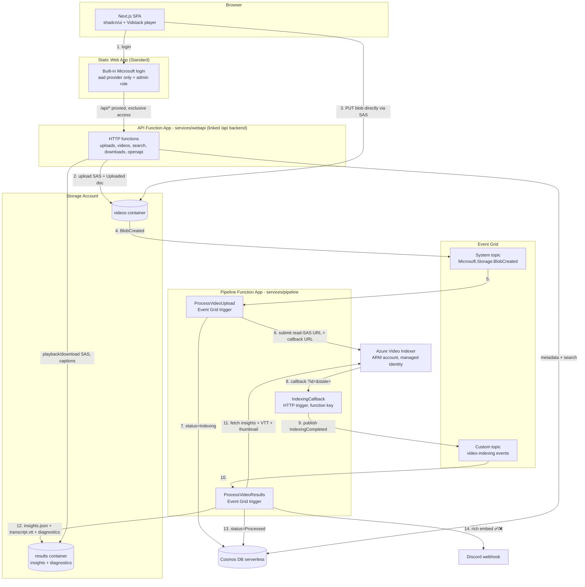

# Implementation Plan — Serverless Video Transcription & Indexer

> Status: **v5 — APPROVED & FROZEN (2026-08-12). This document is the build contract and
> is now read-only; do not edit it. Corrections or scope changes go to ADRs in
> docs/adr/ (referencing the section they amend), never into this file.**
> Source requirement: [requirement.md](requirement.md)
> Last updated: 2026-08-12
>
> **Document lifecycle**: this plan stays a single file — the reviewed contract for the
> build. As milestones land, its content *graduates* into the living documents it already
> defines (CONTRIBUTING.md, docs/style-guide.md, docs/testing-principles.md, docs/setup.md,
> docs/support-runbook.md, ADRs in docs/adr/) rather than being maintained here twice.
> After M7 this file is frozen as the historical record. A lean **CLAUDE.md** (operational
> context for agent sessions: commands, non-negotiables, gotchas, pointers — never a copy
> of this plan) is created as the first file of M0 and evolves with each milestone.

## 1. Goal

An event-driven, serverless video transcription pipeline on Azure with a web UI:

- Users log in with a Microsoft account, upload videos from the browser, watch them
  progress through `Uploaded → Indexing → Processed`, then play them back in a modern
  player with closed captions, a synced clickable transcript, chapters, keywords, and
  full-text **search across everything that was said** in any video.
- Videos uploaded to Blob Storage automatically flow through Event Grid → Azure Functions →
  Azure Video Indexer, with insights persisted to Cosmos DB and a results container, and a
  rich Discord notification on completion or failure.
- **All** cloud resources are defined in Bicep. The entire stack can be destroyed
  (`az group delete`) and recreated from GitHub Actions at any time with **zero manual
  portal steps** and **no Azure credential secrets stored in GitHub**.

### Confirmed decisions

| Topic | Decision |
|---|---|
| UI | Next.js (static export) + Tailwind CSS on **Azure Static Web Apps — Standard tier (~$9/mo while deployed)** |
| UI components | **shadcn/ui** (Radix-based, components copied into the repo) |
| Theme | Light/dark/system switch via `next-themes`; preference persisted in **localStorage** (survives browser restarts; sessionStorage adds nothing on top — see §4) |
| Player | **Vidstack** player UI (streaming-service look & feel: captions menu, speed, PiP, keyboard shortcuts, chapter markers) over progressive MP4 — no adaptive bitrate (see §4) |
| Subtitles | Yes — `transcript.vtt` attached as a native text track with CC toggle |
| DRM / screenshot prevention | **Out of scope** (honest assessment in §4); deterrent instead: **forensic watermark overlay** (viewer's email) + no-download controls |
| Search | Yes — `GET /api/search` over names/keywords/topics/**timestamped transcript lines**; results deep-link into the player at the matching moment |
| Upload policy | Accept all VI-indexable formats; **warn at upload** when a file won't play in browsers; watch page shows a custom "preview unavailable" message (transcript/insights still shown) |
| API / Functions | **Node.js 24 LTS + TypeScript** everywhere — verified GA on Azure Functions v4 (supported: 24.x, 22.x; Node 20 is EOL and delisted). Function apps configured 64-bit (Node 24 requirement). Version pinned repo-wide: `.nvmrc` + `engines` + `packageManager`, CI reads `.nvmrc` — dev/CI/cloud always match. Your machine default (Node 26 via nvm) stays untouched; `nvm use` in the repo switches per-project |
| API hosting | **Standalone Function App linked as SWA backend** — SWA gets *exclusive* access (Easy Auth provider created by linking); fully keyless via managed identity |
| API docs | OpenAPI generated from zod schemas; **Scalar** page at `/docs`, auth-gated, working "try it"; **linked from the app nav, and rendered inside the app shell so navigation is bi-directional** |
| Health checks | `GET /api/health` (anonymous, terse) + `/api/health/detailed` (auth'd, per-dependency); **Azure-side monitoring only**: App Insights availability test + metric alerts → email; health dot in the UI footer |
| Test reports | Published on every CI run: job summary tables, inline failure annotations, coverage PR comment, HTML reports as artifacts **and on GitHub Pages**; README badges |
| UI feedback & stats | Toasts for every action + completion toasts while polling; delete confirm dialogs; **dashboard stat tiles + completion-rate chart** fed by `GET /api/stats` |
| Design direction | **"Signal" — broadcast/edit-suite aesthetic** (§4): dark-first, timecode motifs, Space Grotesk + Inter + JetBrains Mono, amber accent — explicitly not stock-shadcn look |
| Auth & roles | SWA built-in Microsoft (Entra) login only; any valid Microsoft account, fully logged. **Downloads (video + subtitles) open to any signed-in user.** Custom **`admin` role via SWA invitation**; delete = owner or admin (admin can delete any) |
| Account UX | Header **user menu**: initials avatar, name/email, provider, **own roles as badges**, logout, switch-account. Real profile photo/bio not available from built-in auth (honest note in §4) |
| Test accounts | **Entra tenant users** (`testerN@<tenant>.onmicrosoft.com`) issued with passwords via `scripts/create-test-user.sh` — free, non-admin by default (§9) |
| Notifications | **Discord webhook** — rich embed with emoji/status/thumbnail on Processed/Failed |
| Observability | App Insights end-to-end tracing; user-facing **tracking ID** on errors; support runbook with KQL; downloadable diagnostics bundle for local replay |
| Data | Cosmos DB serverless, provisioned by Bicep (no migrations — see §5) |
| Identity | **System-assigned managed identity everywhere — zero data-plane connection strings** (§5) |
| Monorepo | **pnpm workspaces + Turborepo**, path-filtered GitHub Actions per service |
| IaC | Bicep, subscription-scope deployment, delete/recreate friendly; **budget alert included** |
| Repo | **Public**, name `serverless-video-transcription-and-indexer`, region `eastus` |
| Deploys | **Mandatory (automatic) on `main` and `release/**`**; optional manual dispatch from other branches; fork PRs never deploy |
| AI review | **Claude Code GitHub Action** reviews every PR |
| Quality | Strict TS + ESLint, TDD for domain logic, SOLID via ports & adapters, 80% coverage gate |

## 2. Architecture



### Why two function apps (updated rationale)

- **`services/webapi`** — user-facing HTTP API, linked as the SWA backend. Linking
  requires SWA **Standard** and automatically creates an Easy Auth identity provider
  ("Azure Static Web Apps (Linked)") on the function app, so **the static web app has
  exclusive access** — direct calls to the function app's own URL are rejected by the
  platform. This is the real answer to "API accessible from the UI only": enforced by
  Easy Auth, not CORS, not header checks. Functions use `authLevel: anonymous` behind it;
  SWA forwards `x-ms-client-principal` (identity + roles) with every proxied request.
  System-assigned managed identity → **keyless** Cosmos + Storage access (the v2
  connection-string tradeoff is gone — this is what the paid tier buys).
- **`services/pipeline`** — no user surface: Event Grid triggers + the VI callback
  (function-key URL known only to Video Indexer). Kept separate so the SWA-exclusive
  Easy Auth lockdown on webapi never has to carve out exceptions for Event Grid delivery
  or VI callbacks, and so API and pipeline deploy independently.
- Linked-backend constraints honored by design: webapi is on **Consumption (Y1)** (Flex
  Consumption isn't supported for linked backends), keeps the default `/api` route
  prefix, and the SWA deployment sets `api_location: ""`.

### Flow notes

1. **Upload**: `POST /api/uploads` validates type/size, creates the `Uploaded` Cosmos doc
   stamped with `uploadedBy` (from the client principal), and returns a short-lived
   write-only SAS for `videos/{uploadId}/{filename}`; the browser uploads directly
   (chunked, with progress). If the format is VI-indexable but not browser-playable, the
   response flags it and the UI shows the warning before starting the upload.
2. **ProcessVideoUpload** (Event Grid trigger, filtered to the `videos` container and
   `PutBlob`/`PutBlockList` APIs) generates a read SAS for the blob, obtains a Video
   Indexer access token via ARM (`generateAccessToken`, managed identity — no API keys),
   submits the video, and updates the doc to `Indexing` with the VI video ID.
3. **Video Indexer** processes asynchronously and calls back `IndexingCallback` with
   `id` + `state` query params.
4. **IndexingCallback** does not trust the callback payload: it only republishes a
   `VideoIndexing.Completed` event to the custom Event Grid topic (keeping the
   requirement's Event Grid orchestration intact and allowing future subscribers).
5. **ProcessVideoResults** fetches the full index + VTT captions from Video Indexer
   (authenticated fetch — forged callbacks yield nothing), stores `insights.json` and
   `transcript.vtt` under `results/{uploadId}/`, upserts the doc to `Processed` (including
   timestamped transcript lines for search), and posts the Discord notification.
6. Every stage persists its raw inputs/outputs to `results/{uploadId}/diagnostics/` for
   the local-replay debugging story (§7).
7. The UI polls `GET /api/videos`; the watch page plays via short-lived read SAS (range
   requests → seeking works), captions from `transcript.vtt`, chapters from VI topics, and
   honors `?t=<seconds>` deep links from search results.

### Deviations from requirement.md (intentional corrections)

| # | requirement.md says | Plan does instead | Why |
|---|---|---|---|
| 1 | Create VI account via `az cognitiveservices` + API keys | `Microsoft.VideoIndexer/accounts` ARM resource + managed-identity `generateAccessToken` | Key-based (classic) VI auth is deprecated; ARM accounts are the supported model |
| 2 | VI `callbackUrl` = Event Grid topic endpoint | `callbackUrl` = HTTP function, which republishes to the topic | Event Grid topics require an `aeg-sas-key` header VI cannot send; the doc's wiring silently drops every completion event |
| 3 | Pass raw blob URL to VI | Pass a short-lived read SAS URL | The `videos` container is private |
| 4 | Imperative `az` CLI scripts | Bicep modules, subscription-scope deployment | Your requirement: declarative, delete/recreate-able |
| 5 | No UI, no API | Next.js UI + web API added | Your requirement |
| 6 | `axios` dependency | Native `fetch` | Fewer deps |
| 7 | Node.js 20 runtime | Node.js 24 LTS (Functions-GA, verified) | Node 20 reached end-of-life April 2026 and is no longer a supported Functions runtime |

## 3. Monorepo layout

```
.
├── apps/
│   └── web/                    # Next.js static export + Tailwind + shadcn/ui + Vidstack
│       └── staticwebapp.config.json   # auth route rules (aad only), roles, api_location ""
├── services/
│   ├── webapi/                 # Function App (Consumption) — linked SWA backend, HTTP API
│   └── pipeline/               # Function App (Flex) — Event Grid triggers + VI callback
├── packages/
│   ├── shared/                 # API contracts, zod schemas → OpenAPI, insight parsers
│   └── config/                 # shared tsconfig / eslint / prettier presets
├── infra/
│   ├── main.bicep              # subscription scope: RG + all modules
│   ├── main.bicepparam
│   ├── bicepconfig.json
│   └── modules/
│       ├── storage.bicep       # account + containers + CORS (upload PUT, captions GET)
│       ├── cosmos.bicep        # serverless + VideoAnalytics/VideoMetadata
│       ├── video-indexer.bicep # ARM VI account + identity + storage role assignment
│       ├── webapi-app.bicep    # API Function App (Y1) + linkedBackends to SWA
│       ├── pipeline-app.bicep  # Pipeline Function App (Flex) + App Insights + Log Analytics
│       ├── static-web-app.bicep# SWA Standard + app settings
│       ├── event-grid.bicep    # system + custom topics + subscriptions (phase 2 only)
│       ├── rbac.bicep          # all role assignments
│       ├── alerts.bicep        # availability test + failure/dead-letter alerts + action group
│       └── budget.bicep        # RG budget + alert emails
├── scripts/
│   ├── bootstrap-azure.sh      # one-time: Entra app + GitHub OIDC federated credentials
│   ├── create-test-user.sh     # issue Entra tenant test accounts with passwords
│   ├── smoke-test.ts           # post-deploy: upload sample clip, poll until Processed
│   └── download-diagnostics.ts # pull a video's full diagnostics bundle for local replay
├── .claude/skills/             # vendored design skills (frontend-design, ui-ux-pro-max)
├── .github/workflows/          # see §9
├── docs/                       # setup, teardown-recreate, style-guide, testing-principles,
│   └── adr/                    #   support-runbook, ADRs
├── CONTRIBUTING.md
├── turbo.json
├── pnpm-workspace.yaml
└── package.json
```

## 4. Services

### apps/web (Next.js static export + Tailwind + shadcn/ui)

- `output: 'export'` — pure static SPA; SWA serves it, `/api/*` proxies to webapi.
- **shadcn/ui** components copied into the repo; styled via Tailwind + CSS variables.
- **Theme**: `next-themes`, `darkMode: 'class'`, light/dark/system toggle.
  *Persistence*: next-themes writes the choice to **localStorage**, which survives browser
  restarts and covers every tab; sessionStorage would only duplicate it with a shorter
  lifetime (per-tab, gone on close), so it isn't used. First visit falls back to the OS
  preference via `prefers-color-scheme`.
- **Player (`/videos/watch?id=…&t=…`)** — **Vidstack** over the native `<video>` element:
  - Streaming-service UX: custom themed controls, captions menu, playback speed, PiP,
    fullscreen, keyboard shortcuts, buffered/seek preview bar, **chapter markers derived
    from VI topics/scenes**.
  - **Subtitles**: `transcript.vtt` attached as a native text track (CC toggle). Results
    container CORS allows the SWA origin for track fetches.
  - Synced transcript panel: highlights the current line, click-to-seek; `?t=` deep links
    seek on load (used by search results).
  - **Honest limits** (as you anticipated): true "Netflix-style" **adaptive bitrate**
    needs multi-rendition transcoding + HLS/DASH packaging. Azure Media Services was
    retired (June 2024), so that means a self-managed ffmpeg/packager pipeline or a paid
    third-party service — out of scope; we play the uploaded MP4/WebM progressively
    (range requests give instant seeking). Recorded as an ADR with the upgrade path.
  - **DRM / screenshot prevention — recommendation: skip.** Real DRM
    (Widevine/PlayReady/FairPlay) requires encrypted ABR streams plus a license server
    (third-party after AMS retirement) — significant cost/complexity. And even full DRM
    **cannot reliably prevent screenshots**: software-level DRM (the tier desktop
    browsers get) doesn't black out screen capture, and the phone-camera "analog hole"
    always exists. What we do instead: a **forensic watermark overlay** (signed-in
    user's email, low-opacity, periodically repositioned) so any leaked capture is
    attributable, `controlsList="nodownload"`, context-menu disabled on the player, and
    short-lived playback SAS. Deterrence + attribution, honestly labeled as such.
  - **Non-playable formats**: uploads of VI-indexable but non-browser-playable types
    (AVI, MKV, WMV…) are allowed **with a warning at upload time**; the doc stores
    `playable: false` and the watch page replaces the player with a custom "This format
    can't be previewed in the browser" panel — transcript, insights, search, and
    (owner/admin) download all still work.
- **Search (`/search`)**: search box in the header; results show video cards with
  matching transcript snippets + timestamps; clicking a snippet opens the watch page at
  that moment (`?t=`).
- `/docs` — **Scalar API reference** rendering `/api/openapi.json`, behind the same auth
  wall; "try it" works via the session cookie. **Bi-directional navigation**: "API Docs"
  lives in the app's main nav/user menu, and because the Scalar page is rendered *inside*
  the app shell (same header), one click returns to any app page — no dead-end docs site.
- **Interactive feedback** (shadcn `sonner` toasts + `AlertDialog`):
  - Toasts for upload started/completed/failed, copy-tracking-ID, delete done.
  - **Completion toasts**: the status poller diffs results — when a video flips to
    `Processed`/`Failed` while you're anywhere in the app, a toast announces it with a
    jump-to-watch action.
  - Destructive actions (delete) always confirm via dialog, showing exactly what dies.
- **Dashboard (home)**: stat tiles + a completion-rate view fed by `GET /api/stats` —
  total videos, processed %, failed count, avg indexing time, minutes indexed this month
  (tracks the VI free-hours budget); per-video stage timeline
  (`Uploaded → Indexing → Processed`) with live upload progress bars. Charts follow a
  consistent, accessible viz system (same tokens in both themes).
- Footer **health dot** fed by `/api/health` (green/amber/red + last-checked tooltip).
- **Design language — "Signal"** (deliberately not stock-shadcn):
  - Concept: a broadcast/edit-suite console — the app treats every video as *footage
    with a signal to extract* (transcripts, keywords, moments).
  - Type: **Space Grotesk** (display) + **Inter** (body) + **JetBrains Mono** for
    everything time-coded — timestamps, durations, tracking IDs, transcript times —
    tabular, like an edit deck.
  - Color: dark-first charcoal with warm-gray surfaces; **signal-amber accent**;
    status hues with meaning (amber pulse = indexing, green = processed, red = failed);
    light theme derived from the same tokens, both first-class.
  - Motifs: thin scanline dividers, film-frame video cards, waveform-styled progress
    bars, VU-meter-inspired stat tiles, timecode chips on transcript lines.
  - Motion: restrained micro-interactions only (status pulse, progress shimmer, toast
    slide) — no gratuitous animation.
  - Process guard against genericness: M4 starts with a **style tile + the watch page**
    for your review before the rest of the UI is built in that language.
  - **Design skills (vendored in `.claude/skills/`, audited: MIT/stdlib-only, no network
    calls)**: Anthropic's `frontend-design` (anti-templated craft process: token system →
    signature element → generic-check before coding) and `ui-ux-pro-max` (searchable local
    database: 84 styles / 192 palettes / 74 font pairings / 98 UX guidelines + a
    priority-ranked accessibility & UX checklist). M4 workflow: run its design-system
    generator for candidates, filter through the "Signal" concept and `frontend-design`'s
    two-pass review, then apply its UX/accessibility checklist as the pre-delivery QC
    gate on every page. Versioned in-repo so contributors' and reviewers' agents get the
    same design intelligence.
- Auth UX via `/.auth/login/aad`, `/.auth/me`, `/.auth/logout`; other provider routes
  blocked — Microsoft accounts only.
- **User menu** (shadcn `DropdownMenu` + `Avatar`), fed by `/.auth/me`:
  - **Avatar**: deterministic initials + color derived from `userDetails`. *Honest
    limitation*: SWA built-in auth exposes only `userId`, `userDetails` (email/username),
    provider, and roles — **no profile photo or bio**. A real Microsoft photo needs a
    Graph API token, which requires a custom Entra app registration + MSAL — recorded as
    an ADR'd future option, not worth the recreate-story cost now.
  - Shows name/email, identity provider, and the **user's own roles as badges**
    (`authenticated`, `admin`). Safe to show: `/.auth/me` only ever returns the caller's
    own principal — nobody can see anyone else's roles.
  - **Logout** → `/.auth/logout`.
  - **Switch account** → `/.auth/logout?post_logout_redirect_uri=/.auth/login/aad`
    (clear SWA session, immediately re-enter login). When the browser holds multiple
    Microsoft sessions, Microsoft's own account picker appears. *Caveat*: with exactly
    one active Microsoft session, SSO may silently sign the same account back in —
    forcing `prompt=select_account` isn't supported on built-in providers (needs custom
    auth registration). The menu links "Sign out of Microsoft too" for that case.
- **Error UX**: global error boundary + API error envelope surface a tracking ID
  ("quote `VXT-a1b2c3d4` to support") — see §6.
- Tailwind practices (enforced via docs/style-guide.md + tooling): tokens as CSS
  variables, `prettier-plugin-tailwindcss`, `cn()`/`cva`, no `@apply` sprawl, no inline
  styles, arbitrary values only with justification, mobile-first.
- Component tests with Vitest + React Testing Library.

### services/webapi (Function App, Consumption Y1, linked SWA backend)

| Endpoint | Auth rule | Purpose |
|---|---|---|
| `POST /api/uploads` | any signed-in user | Validate type/size → `Uploaded` doc (with `uploadedBy`, `playable` flag) → write-only SAS (15 min) |
| `GET /api/videos` | any signed-in user | List docs (status, name, duration, uploader, playable) |
| `GET /api/videos/{id}` | any signed-in user | Full metadata + insight summary + short-lived playback SAS + captions URL |
| `GET /api/videos/{id}/transcript` | any signed-in user | Timestamped transcript JSON |
| `GET /api/search?q=` | any signed-in user | Matches across name/keywords/topics/transcript lines, with timestamps |
| `GET /api/videos/{id}/download` | any signed-in user | Read SAS with `content-disposition: attachment` for the source video |
| `GET /api/videos/{id}/download/transcript?format=vtt\|json` | any signed-in user | Subtitles/transcript file download |
| `DELETE /api/videos/{id}` | **owner or `admin`** | Delete blob + results + metadata doc; admin can delete anyone's, owner only their own |
| `GET /api/openapi.json` | any signed-in user | OpenAPI 3.1, generated from shared zod schemas |
| `GET /api/stats` | any signed-in user | Aggregates for the dashboard: totals, processed/failed rates, avg indexing time, minutes indexed this month |
| `GET /api/health` | **anonymous** (the only unauthenticated route, carved out in `staticwebapp.config.json`) | Terse liveness + dependency status (`ok`/`degraded`/`down`) — no versions, no config, nothing leakable |
| `GET /api/health/detailed` | any signed-in user | Per-dependency checks (Cosmos, Storage) with latencies |

- **Authorization**: every handler parses `x-ms-client-principal` (identity + roles,
  injected by SWA; unreachable except through SWA, so it's trustworthy). The whole
  library — browse, watch, search, **download video + subtitles** — is open to every
  signed-in user (your round-3 decision). The `admin` role (custom SWA role granted by
  invitation, documented in docs/setup.md, assignable/revocable anytime with no code
  change) now differentiates on **delete**: owners can delete their own uploads, admins
  can delete any — which also keeps role-based testing meaningful (an admin and a
  non-admin visibly behave differently). Flag this if you'd rather admin-only delete or
  no delete at all.
- **Search implementation**: Cosmos query over the stored timestamped transcript lines
  (case-insensitive contains) + name/keywords/topics. Fine at this scale (serverless RU
  cost, pennies); ADR records the upgrade path to Azure AI Search (also the
  requirement.md "challenge" item) if volume grows.
- Every request logs `userId`/`userDetails` + operation to App Insights (audit trail).
- All responses use a common envelope; errors carry `trackingId`.
- **System-assigned managed identity** → Cosmos data-plane role + Storage Blob Data
  Contributor (user-delegation SAS for uploads/playback/downloads, results reads).
  **No connection strings anywhere.**

### services/pipeline (Function App, Flex Consumption)

- Functions: `ProcessVideoUpload` (EG trigger), `IndexingCallback` (HTTP, function-key
  auth), `ProcessVideoResults` (EG trigger).
- **System-assigned managed identity**: Storage Blob Data Contributor, Cosmos data-plane
  role, Contributor on the VI account (for `generateAccessToken`), EventGrid Data Sender.
- Ports & adapters (SOLID):
  - `src/core/` — pure domain: insight parsing (VI JSON → transcript/keywords/topics/
    chapters), SAS policy, event contracts, status state machine, notification
    composition, playability rules. **TDD, ~100% coverage.**
  - `src/ports/` — `VideoIndexerClient`, `MetadataRepository`, `ResultsStore`,
    `EventPublisher`, `UploadStore`, `NotificationPublisher`, `DiagnosticsStore`.
  - `src/adapters/` — Azure SDK + Discord implementations, integration-tested (Azurite;
    Discord against a local HTTP stub).
  - `src/functions/` — thin handlers over a composition root; tested with in-memory fakes.

### Discord notifications

- Rich embed per terminal state: ✅ green (name, duration, uploader, top keywords/topics,
  link to watch page, VI **thumbnail attached as a file** — no public URL needed);
  ❌ red (name, failed stage, tracking ID, App Insights link).
- Webhook URL: GitHub environment secret `DISCORD_WEBHOOK_URL` → `@secure()` Bicep param
  → pipeline app settings only. Never in code or logs. (Key Vault noted in an ADR as
  future hardening; for one secret with delete/recreate cycles, this is simpler and safe.)
- Notification failures never fail the pipeline (logged warning).

### packages/shared

- zod schemas for every API request/response and Event Grid payload — runtime-validated
  on both sides, types inferred, and the source of the OpenAPI spec.
- VI insight parsers (transcript, keywords, topics, chapters, thumbnails) shared by both
  function apps.

## 5. Data & identity

### Cosmos DB — "what about migrations?"

- Cosmos is schemaless: **no tables, no migration scripts**. Bicep provisions the
  account, `VideoAnalytics` database, and `VideoMetadata` container — that deployment *is*
  the initial migration, idempotent on every redeploy. No seed data needed.
- Shape is governed by the shared zod schema, stamped `schemaVersion: 1`; evolution
  policy (version bump + tolerant reads + optional backfill script) lives in
  docs/style-guide.md.
- Document keyed by **uploadId** (generated at SAS issuance, before VI knows the video);
  `videoId` (VI's ID) is attached at submission. Partition key `/id` — cross-partition
  queries are fine at this scale.

```jsonc
{
  "id": "<uploadId>", "videoId": "<vi-id-or-null>", "schemaVersion": 1,
  "name": "demo.mp4", "blobPath": "videos/<uploadId>/demo.mp4", "playable": true,
  "status": "Processed",            // Uploaded | Indexing | Processed | Failed
  "uploadedBy": { "userId": "…", "userDetails": "user@example.com" },
  "durationInSeconds": 62, "keywords": ["…"], "topics": ["…"],
  "transcript": [{ "text": "…", "startSeconds": 1.2, "endSeconds": 4.5 }],
  "resultsPrefix": "results/<uploadId>/",
  "trackingIds": { "upload": "…", "results": "…" },
  "submittedAt": "…", "processedAt": "…", "error": null
}
```

### Managed identity — system-assigned everywhere, zero data-plane secrets

| From → To | Mechanism |
|---|---|
| webapi app → Storage (upload/playback/download SAS, results reads) | System MI + Storage Blob Data Contributor |
| webapi app → Cosmos | System MI + Cosmos data-plane role |
| Pipeline app → Storage / Cosmos / Event Grid topic | System MI + (Blob Data Contributor / Cosmos data role / EventGrid Data Sender) |
| Pipeline app → Video Indexer (`generateAccessToken`) | System MI + Contributor on VI account |
| Video Indexer → its storage | VI's system MI + Storage Blob Data Contributor |
| SWA → webapi | Platform link: Easy Auth provider created by linking → SWA-exclusive access |
| GitHub Actions → Azure | OIDC federated credential |

Why not user-assigned: a UAMI lives in the same resource group, so it dies in every
teardown anyway — no benefit for the recreate story, one more resource and ordering
concern. System-assigned identities are recreated with their resource and Bicep reassigns
roles idempotently (`principalType: 'ServicePrincipal'` set explicitly to avoid AAD
replication races). The only secrets in the entire system: the Discord webhook and the
Anthropic API key — both app-level, both in GitHub environment secrets.

## 6. Observability & production support

- **One App Insights instance** (workspace-based) shared by both function apps; browser
  telemetry via the App Insights JS SDK (connection string is public-safe).
- **Correlation**: W3C trace context end-to-end; `uploadId`/`videoId` + `trackingId`
  stamped as custom dimensions on every log, propagated through Event Grid payloads —
  the whole upload → index → callback → results → notify timeline stitches into one
  searchable story per video.
- **User-facing tracking ID**: UI error boundary + API error envelope surface a short
  code ("quote `VXT-a1b2c3d4`"). Support flow (docs/support-runbook.md): paste the code
  into a provided KQL query → full cross-service timeline + linked diagnostics bundle.
- **Audit**: every authenticated request logs who (`userId`/`userDetails`), what, when —
  including uploads, downloads (owner/admin checks), and search queries.
- Sampling + daily cap configured in Bicep to keep App Insights within pennies.

## 7. Debuggability — download & replay locally

- Every pipeline stage persists raw inputs/outputs to `results/{uploadId}/diagnostics/`:
  triggering Event Grid payload, VI submit response, raw callback query, full VI index
  JSON, composed outputs.
- `pnpm diagnostics --id <uploadId>` downloads the diagnostics folder + Cosmos doc to
  `./.diagnostics/<id>/` (auth: your own `az login`; support needs RBAC read only).
- `pnpm replay --bundle ./.diagnostics/<id>` re-runs the real core logic with
  bundle-backed fakes (`FakeVideoIndexerClient` serves the captured VI JSON) —
  reproducing the exact production execution under a local debugger, no Azure access
  needed. Same fixture format powers tests and local dev.

## 8. Infrastructure (Bicep)

- **Subscription-scope `main.bicep`** creates the resource group and everything in it:
  one command deploys, one `az group delete` destroys.
- **Naming**: `{project}-{env}-{resource}` + `uniqueString(subscription().id, rgName)`
  suffix for globally-unique names. Same inputs → same names on recreate.
- **SWA Standard + linked backend**: `static-web-app.bicep` (Standard SKU) +
  `Microsoft.Web/staticSites/linkedBackends` pointing at the webapi app (Consumption Y1 —
  Flex isn't supported for linked backends). Linking auto-creates the Easy Auth provider
  that locks webapi to SWA-only traffic.
- **Two-phase deploy** (parameter `deployEventSubscriptions`):
  1. *Phase 1 (core)*: everything except Event Grid subscriptions.
  2. *App code deploys* (webapi + pipeline + web).
  3. *Phase 2 (events)*: Event Grid subscriptions targeting the pipeline functions + VI
     callback key wiring. (ARM validates the target function exists — subscriptions can't
     precede code on a fresh stack.)
- `bicep lint` + `what-if` in CI; `what-if` posted on PRs touching `infra/**`.
- **`budget.bicep`**: monthly budget (default **$10**, parameterized) alerting
  `BUDGET_ALERT_EMAIL` at 50% / 80% / 100% actual + 100% forecast.
- **Health & alerting — all Azure-side** (`alerts.bicep`):
  - **App Insights availability test** (`Microsoft.Insights/webtests`, standard test)
    pinging the anonymous `/api/health` through the SWA domain — kept cheap: one probe
    location, 15-minute frequency (both parameterized; billed per execution, cents-level
    at these settings and covered by the budget tripwire).
  - **Metric alerts**: availability-test failures, pipeline function failure count, and
    Event Grid dead-letters.
  - One **action group** emailing `BUDGET_ALERT_EMAIL`, shared by all alerts.
  - Everything lives in the RG: monitoring is destroyed and recreated with the stack —
    no external monitors to clean up or reconfigure.

### Teardown / recreate story

| Concern | Handling |
|---|---|
| Destroy | `destroy.yml` workflow → `az group delete` (typed confirmation input) |
| Recreate | Run `deploy-all.yml` — no GitHub settings changes needed |
| SWA deploy token changes on recreate | Never stored; fetched at deploy time via `az staticwebapp secrets list` |
| Function keys change on recreate | Fetched/wired at deploy time |
| Global name reservation lag | Bump `RESOURCE_SUFFIX` variable and redeploy |
| OIDC app registration | Subscription-level, survives RG deletion — bootstrap runs once, ever |
| Discord webhook / Anthropic key | Live in GitHub secrets, reinjected on deploy |
| `admin` role assignments (SWA invitations) | Re-invite after recreate — documented in teardown-recreate.md (2-minute step) |

## 9. GitHub setup & CI/CD

### One-time bootstrap (docs/setup.md)

`scripts/bootstrap-azure.sh` creates an Entra app registration + **OIDC federated
credentials** (`main` + `release/*` + `production` environment) and assigns Contributor +
User Access Administrator on the subscription. Then create the **public** repo, push, set
the configuration below, and invite your account to the `admin` role.

### Test accounts for other users (non-admin)

Yes — your Azure subscription's **Entra tenant can issue real login accounts with
passwords, for free** (Entra ID Free tier). `scripts/create-test-user.sh` wraps:

```bash
az ad user create \
  --display-name "Tester One" \
  --user-principal-name tester1@<tenant>.onmicrosoft.com \
  --password '<generated>' --force-change-password-next-sign-in
```

Hand out `tester1@<tenant>.onmicrosoft.com` + password; they sign in through the normal
Microsoft login (work/school account path), get the `authenticated` role only — **non-admin
by default** — and are forced to set their own password on first login. Revoke by deleting
the user. Admin is only ever granted by explicit SWA role invitation. (The existing M4
verification item — that the built-in `aad` provider accepts both tenant and personal
accounts — covers these accounts too.)

### GitHub environment `production` — all redefinable, per your requirement

| Kind | Name | Example / note |
|---|---|---|
| Variable | `AZURE_CLIENT_ID` / `AZURE_TENANT_ID` / `AZURE_SUBSCRIPTION_ID` | from bootstrap output |
| Variable | `AZURE_LOCATION` | `eastus` |
| Variable | `AZURE_RESOURCE_GROUP` | `rg-vidx-prod` |
| Variable | `PROJECT_NAME` | `vidx` |
| Variable | `RESOURCE_SUFFIX` | `01` |
| Variable | `BUDGET_ALERT_EMAIL` | your email |
| Variable | `BUDGET_AMOUNT` | `10` |
| Secret | `DISCORD_WEBHOOK_URL` | Discord → channel → Integrations → Webhooks |
| Secret | `ANTHROPIC_API_KEY` | for the AI PR-review workflow |

No Azure credential secrets — deploy auth is OIDC-only.

### Public-repo security posture

- Deploys only from `main` / `release/**` / manual dispatch, inside the `production`
  environment — **fork PRs get no secrets or OIDC and can never deploy**.
- CI for fork PRs runs lint/test/build only.
- AI review auto-runs on same-repo PRs; fork PRs only via maintainer `@claude` comment
  (never `pull_request_target` automation).

### Workflows

| Workflow | Trigger | Does |
|---|---|---|
| `ci.yml` | **every push on every branch + every PR** | turbo lint/typecheck/test/build (affected) → coverage gate → bicep lint; required check. **Test reporting**: JUnit output → job summary table + inline failure annotations; coverage delta as PR comment; HTML test + coverage reports uploaded as artifacts and published to **GitHub Pages** (public repo) — linked from README badges |
| `ai-review.yml` | same-repo PRs (+ maintainer `@claude` for forks) | Claude Code GitHub Action: bugs, style-guide/SOLID violations, missing tests |
| `deploy-web.yml` | push to `main`/`release/**` touching `apps/web/**`, `packages/shared/**`; `workflow_dispatch` | prebuild static export → SWA deploy (`skip_app_build`, `api_location: ""`) |
| `deploy-webapi.yml` | push to `main`/`release/**` touching `services/webapi/**`, `packages/shared/**`; `workflow_dispatch` | bundle → `Azure/functions-action` |
| `deploy-pipeline.yml` | push to `main`/`release/**` touching `services/pipeline/**`, `packages/shared/**`; `workflow_dispatch` | bundle → `Azure/functions-action` |
| `deploy-infra.yml` | push to `main`/`release/**` touching `infra/**`; PRs run `what-if`; `workflow_dispatch` | phase-1 deployment |
| `deploy-all.yml` | manual dispatch | infra phase 1 → webapi + pipeline + web → infra phase 2 → smoke test (upload clip, poll to `Processed`, check Discord ping) |
| `destroy.yml` | manual dispatch + confirmation | delete the resource group |

Mandatory on `main`/`release/**` (path-filtered pushes always deploy), optional elsewhere
(`workflow_dispatch` from any branch). All deploy jobs: OIDC `azure/login`, `production`
environment, concurrency groups.

## 10. Engineering standards

- **CONTRIBUTING.md** — trunk-based branching (`release/**` for cuts), PR rules (small,
  one concern, checks green, AI review addressed), Conventional Commits.
- **docs/style-guide.md** — TS rules (strict, `noUncheckedIndexedAccess`,
  `exactOptionalPropertyTypes`, no `any`, no default exports, import order), React rules,
  Tailwind rules (§4), naming/folders, error-handling + logging conventions (every error
  path carries `trackingId`), Cosmos schema-versioning policy.
- **docs/testing-principles.md** — the pyramid: unit (most — pure `core/`, TDD,
  mock-free by design), handler/component (in-memory fakes at ports only — never mock
  Azure SDKs mid-stack; RTL for components), integration (adapters vs Azurite in CI;
  Cosmos emulator optional/nightly), E2E (post-deploy smoke; Playwright stretch). Fixture
  format = diagnostics-bundle format, so production data replays as tests directly.
- **Coverage**: 80% lines/branches gate on `services/*` + `packages/shared` (Vitest v8,
  per-package, CI-enforced; `core/` parsers ~100%); summary posted as PR comment.
- **Linting**: ESLint flat config (typescript-eslint strict-type-checked + stylistic),
  Prettier + `prettier-plugin-tailwindcss`, `tsc --noEmit`, bicep lint — on every push
  and PR. Husky + lint-staged pre-commit; commitlint.
- **SOLID**: thin handlers (SRP), consumer-owned interfaces (ISP/DIP), SDKs only in
  adapters (OCP — swap VI or Discord without touching core), composition root per app.

## 11. Local development

- `pnpm dev` via turbo: SWA CLI (`swa start`) emulates auth + routing + the linked-API
  proxy; **Azurite** emulates storage; Cosmos via emulator or dev doc-store fake.
- `FakeVideoIndexerClient` (canned fixtures = diagnostics-bundle format) drives the full
  local loop including Discord embeds to a test channel; real VI is exercised by the
  post-deploy smoke test.

## 12. Cost profile (deployed and idle)

**SWA Standard ~$9/mo** (the price of platform-locked APIs + keyless identity — agreed
tradeoff) · 2 Function Apps ≈ $0 idle · Storage + Cosmos serverless < $1/mo ·
Event Grid pennies · VI: 10 free indexing hours/mo, then per-minute · App Insights:
sampled + capped · Budget tripwire at $10/mo (bump `BUDGET_AMOUNT` to ~$15 if the alert
gets noisy with SWA Standard) · Destroy between sessions ≈ $0.

## 13. Milestones

| # | Deliverable | Acceptance criteria |
|---|---|---|
| M0 | **CLAUDE.md (first file)**; repo scaffolding: git init, **Node pinning (`.nvmrc` = 24 LTS, `engines` + `engine-strict`, `packageManager`)**, pnpm + turbo, shared configs, husky, `ci.yml`; CONTRIBUTING, style-guide, testing-principles | `pnpm lint && pnpm test && pnpm build` green locally + CI (CI on the pinned Node, not latest); docs reviewed |
| M1 | `packages/shared`: contracts, zod + OpenAPI generation, VI insight parsers incl. chapters (TDD) | Parsers proven against real VI JSON fixtures; ~100% parser coverage; valid OpenAPI 3.1 |
| M2 | `services/pipeline`: core + ports + adapters + 3 functions, Discord notifier, diagnostics capture (TDD) | Handler tests green with fakes; adapter tests green vs Azurite + Discord stub; replay harness runs a bundle |
| M3 | `services/webapi`: 12 endpoints incl. search, stats, health ×2, open downloads, owner/admin delete (TDD) | Contract tests vs shared schemas; authz matrix tested (owner/admin/other on delete; health anonymous, everything else rejects anonymous); principal logged |
| M4 | `apps/web`: **style tile + watch page first (your sign-off on the "Signal" design)**, then dashboard (stats/rates) / upload (playability warning) / list / watch (Vidstack + CC + chapters + watermark + non-playable fallback) / search / docs (bi-directional nav) pages, user menu, toasts + completion notifications, theme switch, error boundary, footer health dot | Component tests green; full flow incl. search-to-seek works locally under SWA CLI + fake VI |
| M5 | `infra/`: all modules incl. SWA Standard + linked backend + budget + monitoring (availability test, alerts, action group), two-phase wiring | `bicep lint` + `what-if` clean; fresh deploy to scratch RG succeeds; direct webapi URL rejected (SWA-exclusive verified); availability test reporting green in App Insights |
| M6 | Bootstrap script, all workflows incl. AI review, test-report publishing, docs (setup, teardown-recreate, support-runbook) | `deploy-all` from fresh clone + fresh RG succeeds end-to-end; AI review comments on a test PR; test report + coverage visible on GitHub Pages |
| M7 | E2E validation + hardening | Smoke: video → `Processed`, playable with CC + transcript + search hit + Discord embed; delete authz verified live with an issued test account (non-admin) vs admin; forced-failure tracking ID resolvable via runbook; `destroy` → `deploy-all` → smoke passes again |

## 14. Risks & mitigations

| Risk | Mitigation |
|---|---|
| VI ARM API details drift (api-versions, token scope) | Verified live in M2 before building on it |
| Event Grid subscription ↔ function chicken-and-egg | Two-phase deploy (§8) |
| Linked-backend foot-guns (`api_location` must be `""`, `/api` route prefix must remain) | Encoded in workflow + host.json; checked in M5 |
| SWA built-in `aad` provider tenant behavior (personal vs work accounts, incl. issued `onmicrosoft.com` test users) | Verified at M4; config adjusted so any valid Microsoft account signs in |
| Switch-account may silently SSO the same account back in (single Microsoft session) | Documented; "Sign out of Microsoft too" link in the user menu; `prompt=select_account` needs custom auth registration (ADR) |
| Vidstack fit (maintenance, VTT/chapters support) | Evaluated first in M4; fallback: media-chrome or plain `<video>` + custom controls — same SAS/VTT plumbing either way |
| Node version skew (dev machines on newer Node — e.g. 26 via nvm — vs Functions runtime) | Repo-pinned via `.nvmrc` + `engines` (enforced by pnpm `engine-strict`) + CI on the pinned version; docs say `nvm use` before work |
| Browser can't play every VI-indexable format | Warn-at-upload + `playable` flag + custom watch-page fallback (§4) |
| Cosmos name reservation lag on recreate | `RESOURCE_SUFFIX` bump |
| VI regional availability / free-hour quota | Region parameterized; short test clips |
| Public repo secret leakage | OIDC-only Azure auth; environment-scoped secrets; no fork-PR secrets; no `pull_request_target` |
| Open sign-in could burn VI free hours | Full audit trail; budget tripwire; invited-only tightening available via SWA config, no code change |

## 15. Resolved questions

Round 1:
| Question | Resolution |
|---|---|
| shadcn or own components | shadcn/ui, copied into the repo (§4) |
| Theme switch | Yes — light/dark/system via next-themes (§4) |
| Video playback | Yes — SAS-based playback, click-to-seek transcript (§4; player refined in round 4) |
| Best Tailwind/CSS practices | Codified in §4 + docs/style-guide.md, tool-enforced |
| Test coverage | 80% lines/branches gate, `core/` ~100%, CI-enforced (§10) |
| API accessible from UI only | Yes — platform-enforced (§2/§3; strengthened to SWA-exclusive linked backend in round 3) |
| Swagger/Scalar behind auth | Scalar at `/docs`, spec from zod, auth-gated incl. try-it (§4) |
| Discord webhook + key placement | GitHub env secret → `@secure()` Bicep param → app setting; rich embeds (§4) |
| Logging / tracking ID for support | App Insights end-to-end correlation + user-facing tracking ID + KQL runbook (§6) |
| Download data, debug locally | Diagnostics bundles + local replay harness (§7) |
| DB tables / migration scripts | None needed — Bicep provisions Cosmos; zod + `schemaVersion` govern shape (§5) |
| System vs user-assigned MI | System-assigned everywhere, rationale in §5 |
| Repo visibility/name, region | Public, default name, `eastus` (§9) |
| Auth scope | Any valid Microsoft account, every action logged (§4, §6) |
| Budget alert | Yes — $10 default + email variable (§8) |
| Dev rules, style guides, testing principles | CONTRIBUTING.md + docs/style-guide.md + docs/testing-principles.md (§10) |
| Lint + test on push and MR | `ci.yml` on every push and every PR (§9) |
| Deploys mandatory main/release, optional elsewhere | Path-filtered auto-deploy on `main`/`release/**`; manual dispatch for other branches (§9) |
| AI code review for other developers' changes | Claude Code GitHub Action on PRs (§9) |

Round 2:
| Question | Resolution |
|---|---|
| Theme in localStorage + sessionStorage | localStorage (via next-themes) — persists across sessions; sessionStorage intentionally not used (§4) |
| Transcript as subtitles | Yes — native VTT text track with CC toggle (§4) |
| Prevent screenshots / DRM | Not feasible to do honestly (even full DRM doesn't stop screenshots; AMS retired). Forensic watermark + no-download deterrents instead (§4) |
| Search indexed videos in UI | Yes — `/api/search` over timestamped transcripts; results deep-link to the exact moment (§4) |
| Non-playable formats | Accept with upload warning + custom watch-page message (§4) |
| Modern streaming player | Vidstack UI (captions/speed/PiP/chapters); no ABR — depends on transcoding, per your own caveat (§4, ADR) |
| Owner-only vs admin downloads | Enforced in API via `uploadedBy` + SWA `admin` role invitation (§4) |
| Paid tier to fix the identity gap | **SWA Standard** chosen over App Service: linking gives SWA *exclusive* access to the API app (platform-enforced) and full managed identity — App Service would cost more (~$13+/mo B1) and require managing an Entra app registration for Easy Auth (§2, §8) |

Round 3:
| Question | Resolution |
|---|---|
| Downloads for any logged-in user | Adopted — video + subtitles downloadable by every signed-in user; `admin` role now differentiates on **delete** (owner deletes own, admin deletes any) so role-testing stays meaningful (§4 — flag if you'd rather no delete) |
| Login/logout with profile picture, description, account switching, visible roles | User menu with initials avatar, name/email, provider, own-roles badges (safe — `/.auth/me` returns only the caller's principal), logout, switch-account. Real Microsoft photo/bio needs Graph + custom app registration — ADR'd out (§4) |
| Issue Microsoft sub-accounts with passwords for testers | Yes — Entra tenant users (`testerN@<tenant>.onmicrosoft.com`), free, scripted via `scripts/create-test-user.sh`, non-admin by default, forced password change on first login (§9) |

Round 4:
| Question | Resolution |
|---|---|
| API docs linked from UI, bi-directional | Yes — `/docs` is in the app nav and renders Scalar inside the app shell, so both directions are one click (§4) |
| Health checks | `/api/health` (anonymous, terse) + `/api/health/detailed` (auth'd); **Azure-side monitoring per your direction**: App Insights availability test + metric alerts (function failures, dead-letters) → email action group, all in Bicep; footer health dot (§4, §8) |
| Test reports visible from pipeline/project | Job summary tables + failure annotations + coverage PR comment + HTML reports as artifacts and on GitHub Pages + README badges (§9) |
| Interactive popups, completion rates | Toasts (incl. completion toasts from the status poller), confirm dialogs, dashboard stat tiles + rates via `GET /api/stats` (§4) |
| Design skill/inspiration — not generic | "Signal" broadcast-console design language proposed (§4); M4 opens with a style tile + watch page for sign-off. Your two suggested skills (`anthropics/skills` frontend-design + `ui-ux-pro-max`) are audited and vendored into `.claude/skills/` to drive M4 (§4) |

## 16. Out of scope (future — from requirement.md "Challenge" + ADRs)

Translation, content moderation, notifications beyond Discord, Azure AI Search over
transcripts (upgrade path from Cosmos search), Logic Apps branching, ABR streaming/DRM
pipeline. Ports/adapters + the custom Event Grid topic leave clean extension points.
